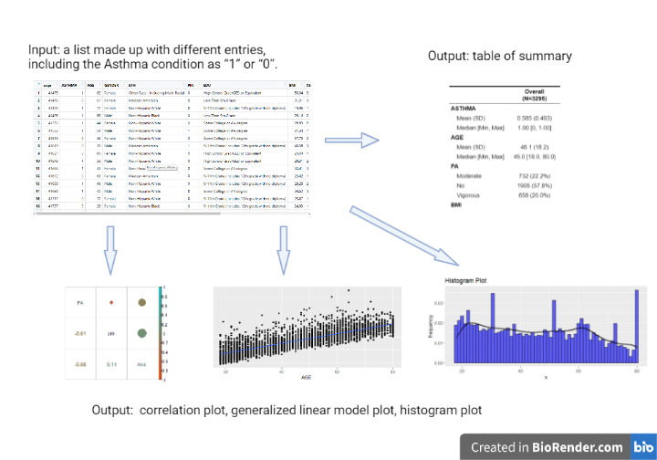

<!-- README.md is generated from README.Rmd. Please edit that file -->

```{r, include = FALSE}
knitr::opts_chunk$set(
  collapse = TRUE,
  comment = "#>",
  fig.path = "man/figures/README-",
  out.width = "100%"
)
```

# asthma

<!-- badges: start -->
<!-- badges: end -->

## Description
This R package mainly shows the relationship between asthma and some variables, such as age, BMI, physical activity (PA), etc. The main purpose is to show the basic description of the data set, such as the maximum and minimum values of the variables, the distribution of the variables, the relationship between the variables, and the final fitted linear regression plot and scatter plot. The results of the linear regression are returned along with the picture. The above can clearly show the distribution of variables in the dataset and the relationship between different variables, which is beneficial for the subsequent empirical work.
The package was developed using R version 4.2.1 (2022-06-23), platform: x86_64-w64-mingw32, and running under Windows 11. 


## Installation

You can install the development version of asthma from [GitHub](https://github.com/) with:

```{r}
require("devtools")
devtools::install_github("https://github.com/zhouti34/asthma", build_vignettes = TRUE)
library("asthma")
```

## Overview
```{r}
ls("package:asthma")
data(package = "asthma") 
browseVignettes("asthma")
```
`asthma`contains 5 functions to demonstrate the relationship between Asthma and other variables, such as age, BMI, physical activity (PA), etc. The `cor_plot`function fit the correlation between variables. It uses the Spearman's correlation coefficient indicates the direction of correlation between X (the independent variable) and Y (the dependent variable). The `describe` function is used to describe the basic situation of the variables in the data set, such as the maximum and minimum values, the 25th quartile and the 75th quartile. `data_pre`function is used to pre-process the data for regression. It is for variables that require categorical analysis, and this function factors out the variable. `glm_process` is used to fit the linear relationship between variables and generalize linear model. It is an extension of the linear model in studying the non-normal distribution of response values and the concise and direct linear transformation of nonlinear models. `his_plot`serves to draw a histogram of the variables, and it is an estimate of the probability distribution of a continuous variable (quantitative variable). `asthma` contains a dataset under the `data` folder, made up of 3295 individuals' information of Asthma, age, gender, ethnics, BMI...etc.   

Refer to package vignettes for more details. An overview of the package is illustrated below.




## Contributions
The author of this package is Tianyan Zhou. The internal data of this package is under the folder `data`, and comes from the dataset of Guo's published paper "Relationships between acrylamide and glycidamide hemoglobin adduct levels and allergy-related outcomes in general US population". `cor_plot` imports packages from `corrplot`,`ggplot2`, `ggcorrplot`, `stats`, `grDevices`. Its correlation plot is generates by `corrplot`.  `glm_process` imports packages from `purrr` and `stats`. The graphics of `his_plot` is generated by package `ggplot2`.

## References
Guo, J., Yu, D., Lv, N., Bai, R., Xu, C., Chen, G., & Cao, W. (2017). Relationships between acrylamide and glycidamide hemoglobin adduct levels and allergy-related outcomes in general US population, NHANES 2005-2006. Environmental pollution (Barking, Essex : 1987), 225, 506–513. <https://doi.org/10.1016/j.envpol.2017.03.016>

H. Wickham. ggplot2: Elegant Graphics for Data Analysis. Springer-Verlag New York, 2016.

Taiyun Wei and Viliam Simko (2021). R package 'corrplot': Visualization of a Correlation Matrix (Version 0.92). Available from <https://github.com/taiyun/corrplot>

Kassambara A (2022). ggcorrplot: Visualization of a Correlation Matrix using 'ggplot2'. R package version 0.1.4, <https://CRAN.R-project.org/package=ggcorrplot>.

R Core Team (2022). R: A language and environment for statistical computing. R Foundation for Statistical Computing, Vienna, Austria. URL <https://www.R-project.org/>.

Henry L, Wickham H (2020). purrr: Functional Programming Tools. R package version 0.3.4, <https://CRAN.R-project.org/package=purrr>.


## Acknowledgements
This package was developed as part of an assessment for 2022 BCB410H: Applied Bioinformatics course at the University of Toronto, Toronto, CANADA. `asthma` welcomes issues, enhancement requests, and other contributions. To submit an issue, use the [GitHub issues](https://github.com/zhouti34/asthma/issues). Many thanks to those who provided feedback to improve this package.


