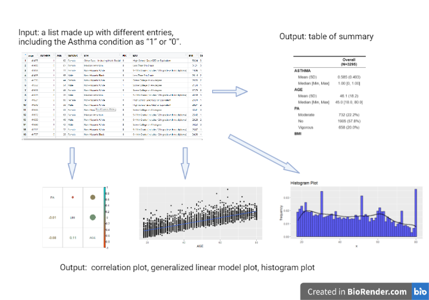

<!-- README.md is generated from README.Rmd. Please edit that file -->

# asthma

<!-- badges: start -->
<!-- badges: end -->

## Description

This R package mainly shows the relationship between asthma and some
variables, such as age, BMI, physical activity (PA), etc. The main
purpose is to show the basic description of the data set, such as the
maximum and minimum values of the variables, the distribution of the
variables, the relationship between the variables, and the final fitted
linear regression plot and scatter plot. The results of the linear
regression are returned along with the picture. The above can clearly
show the distribution of variables in the dataset and the relationship
between different variables, which is beneficial for the subsequent
empirical work. The package was developed using R version 4.2.1
(2022-06-23), platform: x86_64-w64-mingw32, and running under Windows
11.

## Installation

You can install the development version of asthma from
[GitHub](https://github.com/) with:

``` r
require("devtools")
devtools::install_github("https://github.com/zhouti34/asthma", build_vignettes = TRUE)
library("asthma")
```
To run the shiny app:

``` r
runasthma()
```

## Overview

``` r
ls("package:asthma")
data(package = "asthma") 
browseVignettes("asthma")
```

`asthma`contains 5 functions to demonstrate the relationship between
Asthma and other variables, such as age, BMI, physical activity (PA),
etc. The `cor_plot`function fit the correlation between variables. It
uses the Spearman’s correlation coefficient indicates the direction of
correlation between X (the independent variable) and Y (the dependent
variable). The `describe` function is used to describe the basic
situation of the variables in the data set, such as the maximum and
minimum values, the 25th quartile and the 75th quartile.
`data_pre`function is used to pre-process the data for regression. It is
for variables that require categorical analysis, and this function
factors out the variable. `glm_process` is used to fit the linear
relationship between variables and generalize linear model. It is an
extension of the linear model in studying the non-normal distribution of
response values and the concise and direct linear transformation of
nonlinear models. `his_plot`serves to draw a histogram of the variables,
and it is an estimate of the probability distribution of a continuous
variable (quantitative variable). `asthma` contains a dataset under the
`data` folder, made up of 3295 individuals’ information of Asthma, age,
gender, ethnics, BMI…etc.

Refer to package vignettes for more details. An overview of the package
is illustrated below.



## Contributions

The author of this package is Tianyan Zhou. The internal data of this
package is under the folder `data`, and comes from the dataset of Guo’s
published paper “Relationships between acrylamide and glycidamide
hemoglobin adduct levels and allergy-related outcomes in general US
population”. `cor_plot` imports packages from `corrplot`,`ggplot2`,
`ggcorrplot`, `stats`, `grDevices`. Its correlation plot is generates by
`corrplot`. `glm_process` imports packages from `purrr` and `stats`. The
graphics of `his_plot` is generated by package `ggplot2`.

## References

Guo, J., Yu, D., Lv, N., Bai, R., Xu, C., Chen, G., & Cao, W. (2017).
Relationships between acrylamide and glycidamide hemoglobin adduct
levels and allergy-related outcomes in general US population, NHANES
2005-2006. Environmental pollution (Barking, Essex : 1987), 225,
506–513. <https://doi.org/10.1016/j.envpol.2017.03.016>

H. Wickham. ggplot2: Elegant Graphics for Data Analysis. Springer-Verlag
New York, 2016.

Taiyun Wei and Viliam Simko (2021). R package ‘corrplot’: Visualization
of a Correlation Matrix (Version 0.92). Available from
<https://github.com/taiyun/corrplot>

Kassambara A (2022). ggcorrplot: Visualization of a Correlation Matrix
using ‘ggplot2’. R package version 0.1.4,
<https://CRAN.R-project.org/package=ggcorrplot>.

R Core Team (2022). R: A language and environment for statistical
computing. R Foundation for Statistical Computing, Vienna, Austria. URL
<https://www.R-project.org/>.

Henry L, Wickham H (2020). purrr: Functional Programming Tools. R
package version 0.3.4, <https://CRAN.R-project.org/package=purrr>.

## Acknowledgements

This package was developed as part of an assessment for 2022 BCB410H:
Applied Bioinformatics course at the University of Toronto, Toronto,
CANADA. `asthma` welcomes issues, enhancement requests, and other
contributions. To submit an issue, use the [GitHub
issues](https://github.com/zhouti34/asthma/issues). Many thanks to those
who provided feedback to improve this package.
