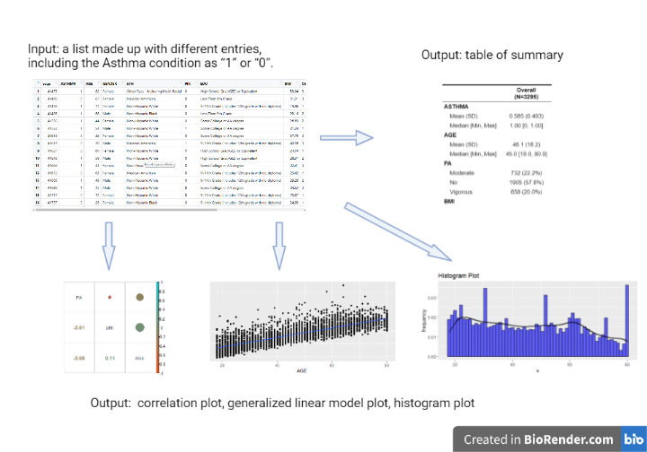

```{r setup, include=FALSE}
library(knitr)
opts_chunk$set(fig.align = "center", 
               out.width = "90%",
               fig.width = 6, fig.height = 5.5,
               dev.args=list(pointsize=10),
               par = TRUE, # needed for setting hook 
               collapse = TRUE, # collapse input & ouput code in chunks
               warning = FALSE)


knit_hooks$set(par = function(before, options, envir)
  { if(before && options$fig.show != "none") 
       par(family = "sans", mar=c(4.1,4.1,1.1,1.1), mgp=c(3,1,0), tcl=-0.5)
})
set.seed(1) # for exact reproducibility
```

## Introduction

**asthma** is an R package developed to the relationship between asthma and some variables, such as age, BMI, physical activity (PA), etc. The main purpose is to show the basic description of the data set, such as the maximum and minimum values of the variables, the distribution of the variables, the relationship between the variables, and the final fitted linear regression plot and scatter plot. The results of the linear regression are returned along with the picture. The above can clearly show the distribution of variables in the dataset and the relationship between different variables, which is beneficial for the subsequent empirical work.

To download **asthma**, use the following commands:


```{r}
require("devtools")
devtools::install_github("https://github.com/zhouti34/asthma", build_vignettes = TRUE)
library("asthma")
```

To list all functions available in the package:
```{r}
ls("package:asthma")
```

<br>

## Components

Components are as following.

<div style="text-align:center">

<div style="text-align:left">


### Functions

Using example from internal dataset test.rda:

```{r}
data("test")
y <- c("ASTHMA")
x <- c("AGE")
cov <- c("PA","BMI")
cor_name <- c("PA","BMI","AGE")
ln_name <- c("AGE")
fc_name <- c("ASTHMA")
family <- "binomial"

data <- test
```

* The **describe** function describe the basic situation of the variables in the data set, such as the maximum and minimum values, the 25th quartile and the 75th quartile. A summary list is also returned in the result, and this table shows the detailed distribution of the variables entered. Variables need to be specified as independent, dependent and covariate variables. The data set contains the prevalence of asthma and some basic information about the population such as
BMI, activity level (PA), age, gender, race, alcohol use (ALQ), and smoking status (COT).

describe() Example:

```{r describe}
describe(x,y,cov,data)
#Return the basic situation of the variables in the data set, including min, 1st quantile, median, mean, 3rd quantile, and max.
```

* The **data_pre** function pre-process the data for regression. For variables that require categorical analysis, this function factors out the variable.log improvement is used for the skewed data distribution. function will return the changed data frame

data_pre() Example:
```{r data_pre}
data_pre(ln_name,fc_name,data)
#Returns the changed dataframe with factored out variables and log improvements.
```

* The **his_plot** function serves to draw a histogram of the variables.
A histogram is an exact graphical representation of the distribution of numerical data. It is an estimate of the probability distribution of a continuous variable (quantitative variable). first step is to segment the range of values. 

his_plot Example:
```{r his_plot}
his_plot(x,"title","xlab","ylab",data)
#Returns a histogram of the x variable and its relative frequency occurred in the dataset specified.
```

* The **cor_plot** function fits the correlation between variables. The Spearman's correlation coefficient indicates the direction of correlation between X (the independent variable) and Y (the dependent variable). If Y tends to increase when X increases, the Spearman's correlation coefficient is positive. If Y tends to decrease when X increases, the Spearman correlation coefficient is negative. A zero coefficient indicates that there is no tendency for Y to increase when X increases. The Spearman correlation coefficient increases in absolute value as X and Y become closer to complete monotonic correlation. When X and Y are completely monotonically correlated, the absolute value of the Spearman correlation coefficient is 1. This function returns a plot of the total correlation, with the size and color of the circles showing the correlation.

cor_plot Example:
```{r cor_plot}
cor_plot(cor_name,data)
#Returns a chart showing the correlation between PA, BMI, and age.
```

* The **glm_process** function is standed for generalized linear model, which is used to fit the linear relationship between variables. The generalize linear model is an extension of the linear model that meet the mathematical expectations of the response variables and the predictor variables of the linear combination are established by a linkage function. The relationship between the mathematical expectation of the response variable and the linear combination of the predictor variables. It is an extension of the linear model in studying the non-normal distribution of response values and the concise and direct linear transformation of nonlinear models.

glm_process Example:
```{r glm_process}
glm_process(x,y,cov,family,data)
#returns a plot showing the generalized linear relationship between the selected variables.
```

<br>

<div style="text-align:left">


## Package Rederences
[Zhou, T. (2022) asthma: An Example R Package For
  BCB410H. Unpublished.](https://github.com/zhouti34/asthma/tree/master)

<br>

## Other References

Guo, J., Yu, D., Lv, N., Bai, R., Xu, C., Chen, G., & Cao, W. (2017). Relationships between acrylamide and glycidamide hemoglobin adduct levels and allergy-related outcomes in general US population, NHANES 2005-2006. Environmental pollution (Barking, Essex : 1987), 225, 506–513. https://doi.org/10.1016/j.envpol.2017.03.016

H. Wickham. ggplot2: Elegant Graphics for Data Analysis. Springer-Verlag New York, 2016.

Taiyun Wei and Viliam Simko (2021). R package ‘corrplot’: Visualization of a Correlation Matrix (Version 0.92). Available from https://github.com/taiyun/corrplot

Kassambara A (2022). ggcorrplot: Visualization of a Correlation Matrix using ‘ggplot2’. R package version 0.1.4, https://CRAN.R-project.org/package=ggcorrplot.

R Core Team (2022). R: A language and environment for statistical computing. R Foundation for Statistical Computing, Vienna, Austria. URL https://www.R-project.org/.

Henry L, Wickham H (2020). purrr: Functional Programming Tools. R package version 0.3.4, https://CRAN.R-project.org/package=purrr.

----

```{r}
sessionInfo()
```

